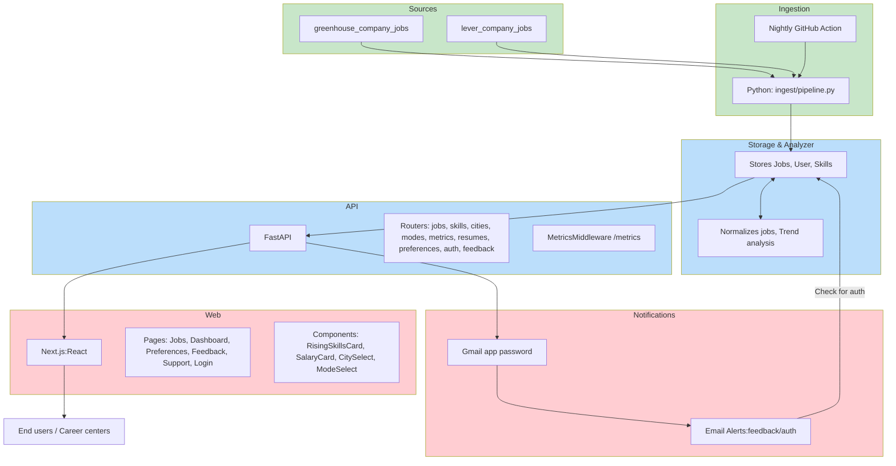

# JME — Job Market Explorer

**Hosted URLs**

* Web (staging): `https://jme-web-staging-7cea87c089d0.herokuapp.com/`
* API (staging): `https://jme-api-staging-13ca850a482b.herokuapp.com/docs`

---

## 1. High-level description

**JME** collects live job postings, normalizes them, extracts skills and salary signals, and serves those insights via a REST API and a modern web UI. Users can:

* browse jobs with filters (**search**, **skill**, **mode** (Remote/Hybrid/On-site), **city**, **date**)
* see **rising skills** and salary snapshots
* set **preferences**
* upload a **resume** to extract structured fields and skills
* send **feedback** (emailed to project maintainers)

It’s designed to be easily hosted (Heroku), maintainable (Alembic migrations, CI), and extendable (pgvector + embeddings ready).

---

## 2. Architecture (diagram & description)

### Diagram (Mermaid)

### Processes & services

* **Ingestion (B1/B2):** A GitHub Action runs nightly, invoking `scripts/nightly_ingest.py`. It fetches data from configured sources, de-duplicates, and normalizes jobs (`jobs`, `skills`, `job_skills` tables). A **spaCy** matcher labels skills; rollups compute counts & trends.
* **Storage (C1):** PostgreSQL stores all entities. Alembic manages schema and indexes (including trigram and lower() indexes for fast search).
* **API (D1/D2):** FastAPI exposes REST endpoints. Key routes:

  * `/api/jobs` — filter by q/skill/mode/city/date; newest first
  * `/api/skills/top`, `/api/skills/rising`
  * `/api/cities`, `/api/modes`
  * `/api/metrics/salary_by_skill`
  * `/api/resumes` (upload → extract structured fields + skills)
  * `/api/user/preferences` (JWT optional)
  * `/api/auth/request_code`, `/api/auth/verify_code` (email code login)
  * `/api/feedback`
* **Web (E1/E2/E3):** Next.js UI:

  * **Dashboard**: Rising skills + salary tiles
  * **Jobs**: filters (search, skill, **mode**, **city**, date), list with “View Posting”
  * **Preferences**: maintain (server or local fallback)
  * **Feedback** and **Support** (Venmo)
  * **Login**: email code; session token stored as `jme_token`.
* **Metrics/Monitoring (D3, F1/F2):**

  * `/metrics` middleware for basic latency/throughput
  * Gmail app password sends Feedback/Auth notifications to `ALERT_TO`
  * Heroku logs used for production issues

---

## 3. Design decisions (and tradeoffs)

### Why PostgreSQL (SQL) instead of NoSQL?

* **Relational joins** (jobs ↔ job_skills ↔ skills) are natural and performant with indexes.
* **Ad hoc filters** (q/skill/mode/city/date) benefit from relational planning and indexes.
* **Migrations**: well-defined schema evolution via Alembic (repeatable deploys).
* **Text search**: Postgres extensions (e.g., **pg_trgm**) offer excellent LIKE/ILIKE performance.

*A NoSQL option* (e.g., Elasticsearch or MongoDB) could be used for full-text search or schema-flexible resumes. We retained Postgres for simplicity and deployed footprint.

### FastAPI + Next.js

* **FastAPI**: strong typing, async I/O, rapid swagger docs, easy testing.
* **Next.js**: file-based routing, SSR/ISR options, Tailwind support; ideal for an SPA-style UI.

### Heroku

* One-button apps, pipeline (staging → production), easy config/secret management.

### Embeddings / pgvector

* We scaffolded a vector column and optional embeddings to support future “semantic” search. Current MVP relies on normalized fields; embeddings can be turned on later.

---

## 4. System requirements & testability

| Requirement                                                      | Implementation                                                                  | How tested                                      |
|------------------------------------------------------------------| ------------------------------------------------------------------------------- | ----------------------------------------------- |
| Display browseable jobs with filters (search/skill/mode/city/days) | `/api/jobs` SQL with normalized **mode/city**; Next.js Jobs page binds controls | Manual E2E + API smoke call in CI               |
| Preferences stored server-side and fallback locally              | `/api/user/preferences` + JWT; UI gracefully saves locally if not logged in     | Manual & localStorage check                     |
| Feedback sends notifications                                     | `/api/feedback` mails to `ALERT_TO` (Gmail app password)                        | Manual form test (received email)               |
| CI build/test + nightly ingest                                   | GitHub Actions for web/api build; Nightly Ingest; *new* API smoke               | Build + smoke pass; ingest job runs on schedule |
| Deployment                                                       | Heroku apps with pipeline; automatic deploys recommended                        | Click “Enable Automatic Deploys” for CD         |

**Testability:**

* CI runs unit tests (Jest) and the new **smoke** tests (curl/JQ or pytest).
* Most requirements are directly testable via HTTP assertions.
* Job query performance validated with indexes (lower(), timestamp, trigram for description).

---

## 5. Whiteboard architecture – services & processes

* **Ingestion**: `scripts/nightly_ingest.py` → `ingest/pipeline.py` → Postgres; optional rollups.
* **API services**: FastAPI routers handle domain concerns (extraction, metrics, preferences, auth).
* **Web**: Next.js pages call JSON endpoints via a single `fetchJSON` utility (auth header supported).
* **Monitoring**: middleware `/metrics`, Heroku logs; Gmail notifications for human-in-the-loop events.

---

## 6. Justifications for specific choices

* **Regex normalization** Job postings had irregular fields and so normalization makes it easier to compare different jobs.
* **Email code login** via Gmail app password—lightweight auth for a student project; easy to maintain without OAuth provisioning complexity.
* **Heroku Postgres**—a managed DB aligns with instruction constraints and speeds iteration.
* **Resume Extraction** I tried to use pattern recongization and removing non essential words, but it still needs more tooling to make it effective. 

---

## 7. References & notes

* **Env/secrets to set**:

  * `DATABASE_URL` (Heroku)
  * `CORS_ORIGINS`, (list)
  * `GMAIL_USER`, `GMAIL_PASS`, `ALERT_TO` for email
  * `JWT_SECRET` for auth
* **CI secrets**:

  * `SMOKE_API_BASE` (e.g., `https://jme-api-staging-...herokuapp.com`)
  * `HEROKU_API_KEY` if your nightly ingest or deploy workflows need it

---

## 8. Future Goals
* Improve Job Normalization to have location listed consistently
* Gather more data to improve salary card and show ranges
* Increase the number of sources for job postings such as Google Cloud Talent Solution
* Improve text extraction of resumes
* Assign scores for jobs based on users resume
* Implement security features such as setting password, changing password.  
